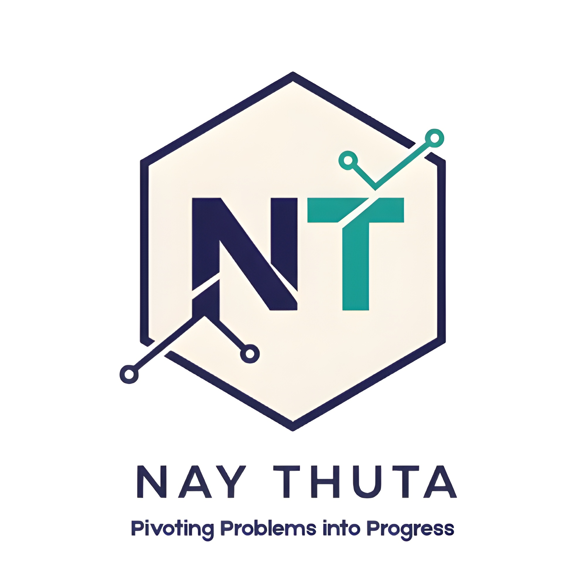

# **Pivoting Problems into Progress**

  

Hi, I'm Nay Thuta, an Engineering with Business graduate from Singapore Polytechnic. My core drive? **Pivoting Problems into Progress.** I leverage my expertise in **systems engineering**, **data analytics**, and **business strategy** to create innovative solutions for real-world challenges. My portfolio demonstrates a track record of quickly grasping complex systems , taking strong initiative to learn new domains, and delivering tangible results in **Project Engineering**, **Business Development**, and **Machine Learning**.

Explore my work to see how I’ve designed, validated, and analyzed with a focus on collaborative problem-solving. I’m eager to launch my career in engineering, contributing my drive and multidisciplinary skills to your team.

[⬇️ Download My Resume](res/resume.pdf)

---

# **Featured Projects**

- [**Sustainable Irrigation System:**](projects/sustainable-irrigation-system.md) Designed a cost-effective, microcontroller-based irrigation prototype for third-world farmers, optimizing water usage with real-time sensor feedback.
- [**WormBrews:**](projects/wormbrews.md) Led market research for a vermicomposting startup, validating demand and refining solutions for urban sustainability.
- [**Patient Sentiment Analysis:**](projects/patient-sentiment-analysis.md) Built an ML system to classify sentiments from 27,703 drug reviews, delivering actionable insights via a Power BI dashboard.

[View All Projects →](projects.md)

---

# **Get in Touch**

Ready to bring my skills in programming, data analytics, and hardware design to your engineering team? I’m actively seeking entry-level roles as a **Project Engineer**, **Process Engineer**, or **Technical Sales Engineer** to contribute innovative solutions in Singapore’s dynamic job market. [Contact me](contact.md) to discuss how I can drive value for your organization, or [download my resume](res/resume.pdf) to explore my qualifications.

---

*Passionate about solving complex problems with technical precision and collaborative teamwork.*