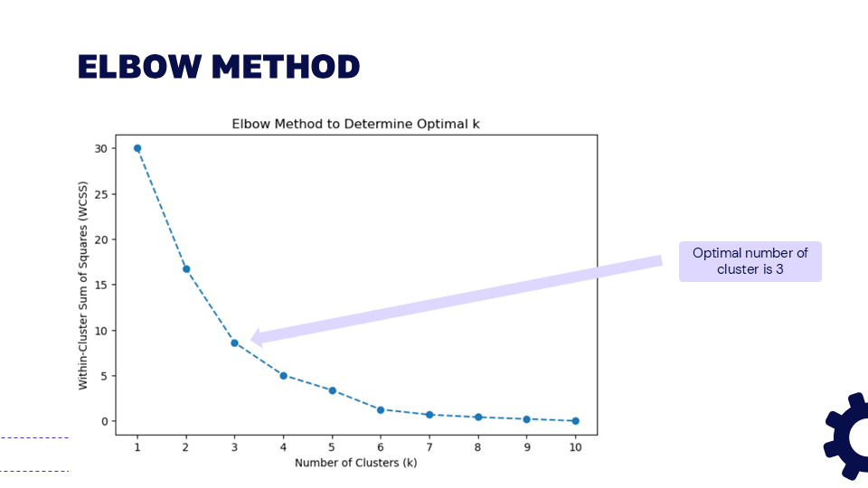
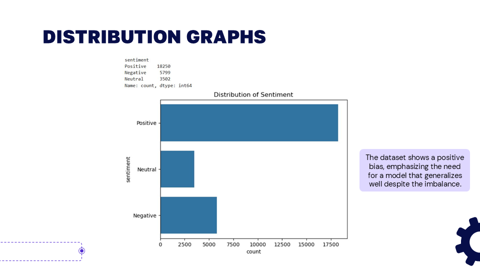
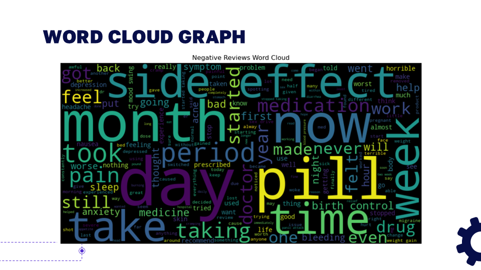
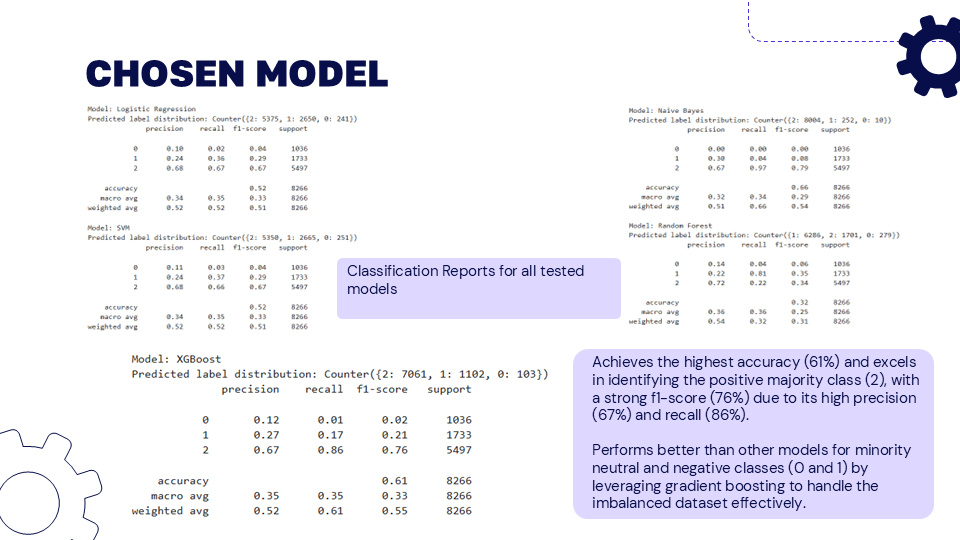
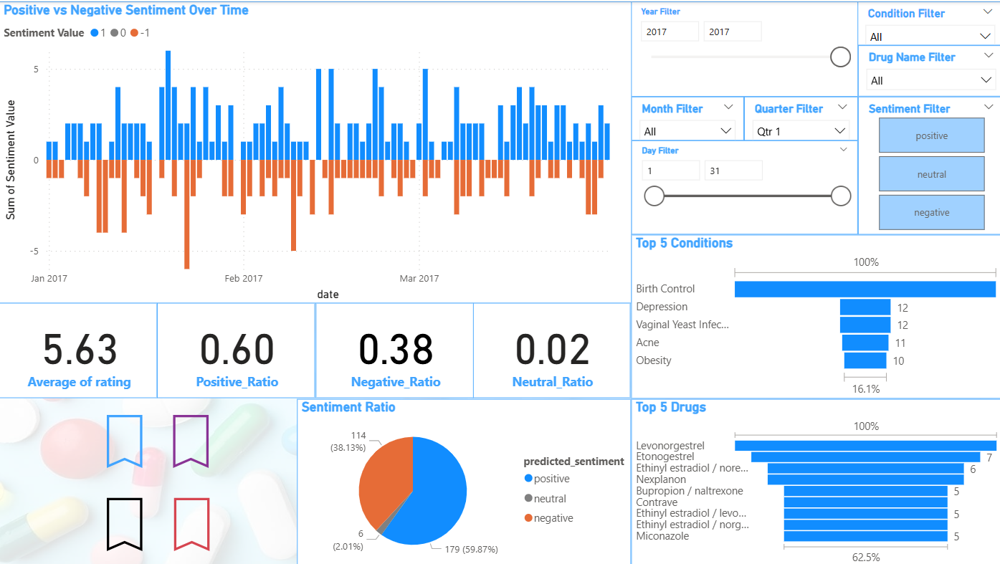

# Patient Sentiment Analysis Project

  
   
  <em>Figure: What is Sentiment Analysis about? (Credit: Aim Technologies)</em>

## **Overview**
In the healthcare industry, understanding patient sentiment from drug reviews is critical yet challenging. This project addresses that by leveraging machine learning to classify sentiments as positive, neutral, or negative, transforming unstructured data into actionable insights.
 
I spearheaded [data preparation](#data-preparation) and [exploratory data analysis (EDA)](#exploratory-data-analysis), ensuring data quality and foundational insights. I also significantly enhanced pre-processing and model development efforts by reviewing and refining my teammates' contributions. My work culminated in designing a dynamic [Power BI dashboard](#power-bi-dashboard), enabling stakeholders to visualize key trends and inform critical healthcare decisions. The project utilized a comprehensive dataset of **27,703 drug reviews** from [drugs.com](https://www.drugs.com), sourced via [Kaggle](https://www.kaggle.com/datasets/mohamedabdelwahabali/drugreview).

---

## **Problem Statement**
Consumers frequently report their experiences with drugs and their side effects in online reviews, particularly on drugs.com. This creates a significant challenge: it's difficult to systematically extract and understand these sentiments without converting them into clear, actionable insights. This project aimed to solve this by providing a robust sentiment analysis framework to support healthcare decisions.

---

## **Data Collection**
The chosen dataset is the "Drug Review Dataset" by Mohamed Abdelwahab Ali, available in clean versions (Arrow, JSON, CSV) from [Kaggle](https://www.kaggle.com/datasets/mohamedabdelwahabali/drugreview), containing 27,703 reviews from [drugs.com](https://www.drugs.com).

---

## **Data Preparation**

  
   
  <em>Figure: Overview of the Dataset (Credit: Aryan Qusyairi)</em>

- **Loading and Initial Check:** I loaded the dataset using `pd.read_csv('drug_review.csv', sep=',')`. An initial inspection with `df.head()` and `df.info()` revealed its structure, including columns like `drugName`, `condition`, `review`, and `rating`, and confirmed **27,703 entries** across 9 columns.
- **Cleaning:**  I standardized formats and addressed missing data, confirming **no missing values** across the dataset with `df.isnull().sum()`. I also verified unique values for key categorical columns like `drugName` (2014 unique drugs) and `condition` (579 unique conditions) using `df.nunique()`, ensuring data integrity and usability. Duplicate rows were also handled to maintain a clean dataset.

---

## **Exploratory Data Analysis**

  
   
  <em>Figure: Demonstration of the Elbow Method</em>

- **Initial Approach (Elbow Method for Clustering):** I checked the optimal number of clusters for sentiment patterns using the elbow method. The process involved calculating the Within-Cluster Sum of Squares (WCSS) with `wcss.append(KMeans(n_clusters=k, random_state=42).inertia_)` and plotting `plt.plot(k_values, wcss, marker='o')` to identify the optimal number of groups.
- **Clustering:** K-means clustering was applied with `KMeans(n_clusters=3, random_state=42)` on the `sentiment_summary[['Negative', 'Neutral', 'Positive']]` features, which were first scaled using `StandardScaler().fit_transform(X)` to ensure fair weighting. This grouped similar reviews based on their sentiment distribution.
- **Clustering Insights:** The cluster centroids, such as `[0.1131492, 0.6688243, 0.1999081]`, clearly demonstrated distinct sentiment patterns within the dataset, providing a basis for deeper analysis.

  
   
  <em>Figure: Sentiment Distribution</em>

- **Sentiment Spread:** I explored the distribution of sentiments by grouping data using `sampled_reviews.groupby('rating', 'sentiment').size().unstack(fill_value=0)` and visualized these distributions with `sns.countplot(df['sentiment'])`. This helped to map out the overall sentiment landscape of the reviews.

  
   
  <em>Figure: Word Cloud Example for Negative Sentiment</em>

- **Word Clouds:** Word clouds were generated using `WordCloud(width=900, height=400).generate([sentiment_type]_reviews)` to highlight prominent terms within different sentiment categories.
- **Insights from Word Clouds:** While intended to provide quick insights, the initial word clouds revealed terms like "take" appearing across all sentiment categories. This highlighted an important discovery: the need for more advanced, domain-specific text cleaning and filtering to extract truly meaningful insights beyond common words.

---

## **Data Pre-processing**
- **Text Cleaning:** The team implemented an NLTK-based pipeline to clean raw text. This involved converting text to lowercase with `str(text).lower()`, removing extra spaces and special characters with `re.sub(r'\r\s', ', ', text)`, and simplifying words using `WordNetLemmatizer()`. Common English stopwords from `nltk.corpus.stopwords.words('english')` were also removed to focus on significant terms.
- **Sentiment Labeling:** A custom function `def label_sentiment(rating): if rating > 7: return 'Positive' elif rating > 4: return 'Neutral' else: return 'Negative'` was applied to the `rating` column, creating a `sentiment` column with categorized labels. This transformation was applied using `df['sentiment'] = df['rating'].apply(label_sentiment)`.
- **Custom Lexicon:** A custom VADER lexicon was built from unigrams, bigrams, and trigrams (with `min_count=15`) using `Counter(unigrams)` and `Counter(bigrams)`. This lexicon's scores, scaled from -1 to +1 based on ratings, were saved as "custom_vader_lexicon.txt", acting as a specialized dictionary for sentiment interpretation.
- **Feature Extraction:** Text data was transformed into numerical features using `TfidfVectorizer(max_features=20000, ngram_range=(1, 2), stop_words='english')`. VADER sentiment scores were then horizontally stacked (`hstack`) with the TF-IDF features. To address class imbalance, `SMOTE(random_state=42)` was employed, ensuring balanced representation for effective model training.

---

## **Model Development**

  
   
  <em>Figure: Why we chose XGBoost (Credit: Joseph Wong)</em>

- **Models:** XGBoost was selected as the primary model due to its performance capabilities. Hyperparameter tuning was performed using `RandomizedSearchCV` to optimize its predictive accuracy for sentiment classification.
- **Evaluation:** The XGBoost model's performance was thoroughly evaluated using `classification_report`, confirming its effectiveness across all sentiment categories and ensuring robust predictions

---

## **Prediction and Deployment**
- **New Data Appplication:** The trained model was applied to a new dataset, `new_drug_reviews.tsv`, undergoing the same cleaning and feature extraction processes, including the use of the `custom_vader_lexicons.txt`. Predictions were then saved to `predicted_sentiments.csv`.
- **Output:** The final pipeline includes the saved model (`improved_xgboost_model.pkl`) and the TF-IDF vectorizer (`improved_tfidf_vectorizer.pkl`), making the solution ready for broader application.

---

## **Power BI Dashboard**

  
   
  <em>Figure: Interactive dashboard for pharmaceutical companies</em>

- **Design:** I designed an interactive Power BI dashboard utilizing the predicted dataset (`predicted_sentiments.csv`) from the model applied to `new_drug_reviews.tsv`. This dashboard features tree charts for the top 5 conditions and drugs, alongside bar charts illustrating sentiment trends (e.g., Q1 2017).
- **Use Cases:** This dashboard serves as a powerful tool to support customer feedback analysis, enhance brand reputation management, and drive product improvement initiatives by visualizing key sentiment trends and patterns derived from the predicted dataset.

---

## **Business Applications**
- **Customer Feedback Analysis:** Gain deeper insights into patient experiences from reviews to continuously improve services and drug efficacy.
- **Brand Reputation Management:** Proactively monitor and respond to public perceptions of drugs, safeguarding and enhancing brand image.
- **Product Improvement:** Identify specific features or aspects of drugs that are consistently liked or disliked, guiding targeted product enhancements and development.

---

## **Conclusion**
This project successfully combined VADER scores, custom lexicons, TF-IDF, and XGBoost to perform comprehensive sentiment analysis on drug reviews. It effectively addressed data imbalances using SMOTE and rigorously tuned models for optimal accuracy. The scalable solution provides significant real-world applicability for patient sentiment understanding.

---

## **Download Project Resources**

[⬇️ Download Presentation Slides (PDF)](../../res/aieba_slides.pdf)  
Download the full presentation for additional details on sentiment analysis implementation.

[⬇️ Download Power BI Dashboard (.pbix)](../../res/powerbi_dashboard.pbix)  
Download the .pbix file to interact with the dashboard and explore data visualizations.

---

  <a href="../">← Back to Projects</a>|<a href="#top">↑ Back to Top</a>

 