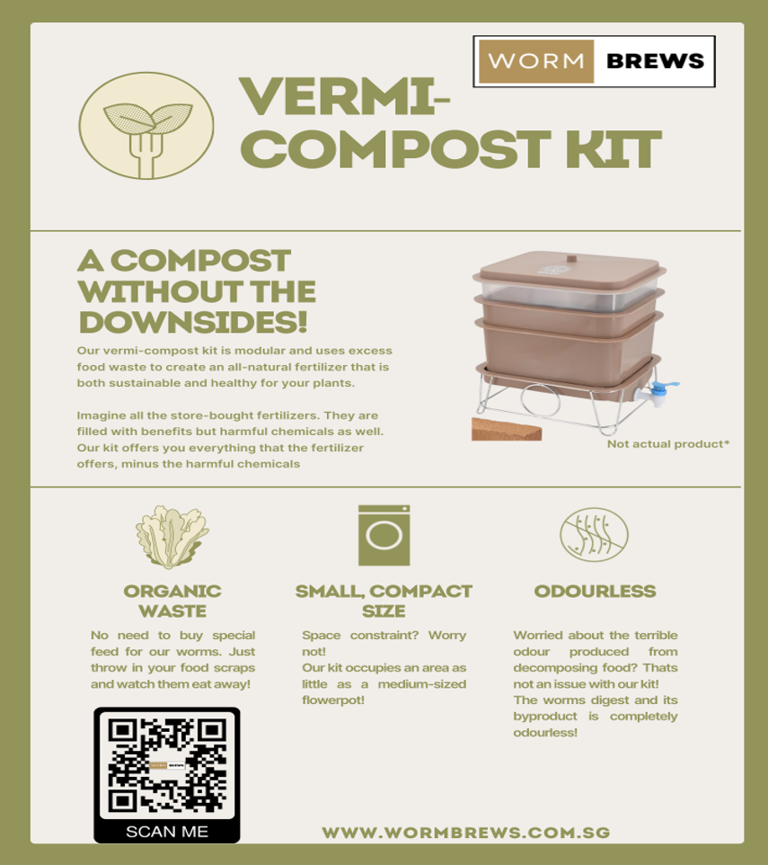
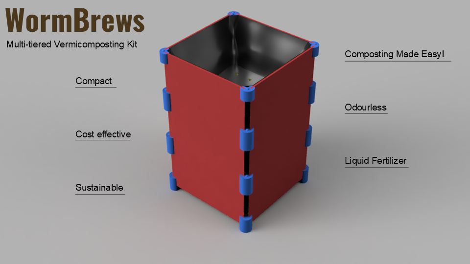
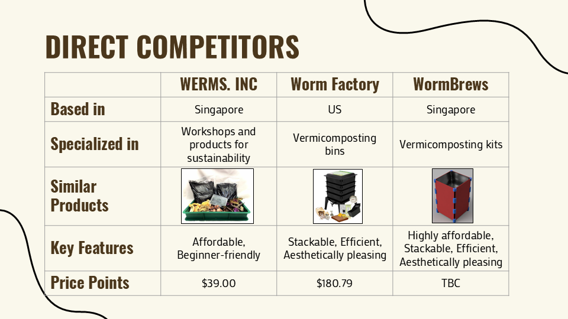

# **WormBrews: Sustainable Fertilizer Startup**

  
   
  <em>Figure: WormBrews promotional banner. (Credit: Shamus Lim Kah Hwee)</em>

## **Overview**
WormBrews began as a vision by Group 3 (Leong Kai Wen, Nay Thuta, Samuel Toh Zheng Hao, Shamus Lim Kah Hwee) to create a multi-tiered vermicomposting kit addressing Singapore's need for space-efficient, eco-friendly composting. My primary contributions include [market research](#market-research), [customer interviews](#customer-interviews), [market validation](#market-validation), and [competitor analysis](#competitor-analysis), all of which drove the project's early development. Launched with enthusiasm, the project aimed to turn urban food waste into sustainable fertilizer.

---

## **Product Features**

  
   
  <em>Figure: Key features and benefits of WormBrews fertilizer. (Credit: Leong Kai Wen)</em>

---

## **Market Research**
- **Target Audience**: Identified urban households, gardeners, and schools in Singapore, motivated by limited space and growing eco-consciousness.
- **Survey Insights**: Surveys showed 85.7% interest, with respondents valuing space savings and odorless operation.
- **Consumer Needs**: Revealed a demand for affordable, low-maintenance composting alternatives, shaping our initial strategy.

---

## **Customer Interviews**
- **Methodology**: I conducted in-person interviews to assess the kit's feasibility and desirability, asking, "What did they think of using a multi-tiered vermicomposting kit to reduce food waste and produce fertilizer?"
- **Key Findings**: 
    1. 22.2% prioritized space efficiency and odor control, with positive notes on indoor usability.
    2. Some saw it as a "portable idea" for domestic use but not industrial scale, with confusion over functionality.
    3. One respondent felt it was "a waste" for small families due to minimal food waste, questioning its practicality.
- **Action Taken**: Feedback prompted design refinements and educational content, though challenges persisted.

---

## **Market Validation**
- **Survey Results**: The 85.7% interest rate initially confirmed demand among urban Singaporeans.
- **Interview Outcomes**: Supported niche appeal but highlighted scalability and understanding gaps.
- **Feasibility**: Real-world input aligned with Singapore's space constraints, yet raised doubts about widespread adoption.

---

## **Competitor Analysis**

  
   
  <em>Figure: Direct Competitors to WormBrews </em>

- **Key Competitors**: 
    1. **WERMS. INC**: Higher-cost vermicomposting solutions.
    2. **Worm Factory**: Multi-tiered systems, less affordable and urban-tailored.
- **WormBrews Advantage**: Offered lower costs with recycled PET connectors, a compact design, and odorless operation.
- **Market Positioning**: Aimed to be an affordable alternative, with a unique selling point of educational workshops targeted towards hobbyists, schools, and other potential customers to enhance understanding and adoption, though desirability and scalability issues persisted.

---

## **Project Conclusion**
Despite early promise, the interview findings, combined with scalability issues and insufficient waste volume for small households, led us to scrap WormBrews. This decision reflects a commitment to aligning with user needs and market realities. The experience honed my skills in market research and validation, offering valuable lessons for future projects.

---

## **Personal Learning Points**
This project was a transformative experience that strengthened my entrepreneurial and professional capabilities, aligning with my core skill set:

- **Entrepreneurship and Market Research**: Conducting surveys and customer interviews enhanced my ability to identify market needs and validate business ideas, aligning with my Certificate in Entrepreneurship from Singapore Polytechnic.
- **Consumer Behavior Analysis**: Analyzing interview feedback to understand user preferences and pain points deepened my skills in consumer behavior, enabling me to tailor solutions to specific audience needs.
- **Project Management**: Coordinating research, interviews, and competitor analysis honed my project management skills, ensuring timely execution and effective team collaboration.
- **Problem-Solving and Adaptability**: Addressing scalability challenges and pivoting based on feedback strengthened my problem-solving and adaptability, preparing me to navigate dynamic business environments.

---

## **How WormBrews Works?**

Watch an animated demonstration of the WormBrews vermiposting kit in action:

  <video width="560" height="315" controls style="max-width: 100%; height: auto;">
    <source src="../../res/wormbrews_demo.mp4" type="video/mp4">
    Your browser does not support the video tag.
  </video>
   
  <em> Video: WormBrews Product Demo (Credit: Leong Kai Wen).</em>

---

  <a href="../index.html">← Back to Projects</a>|<a href="#top">↑ Back to Top</a>

 